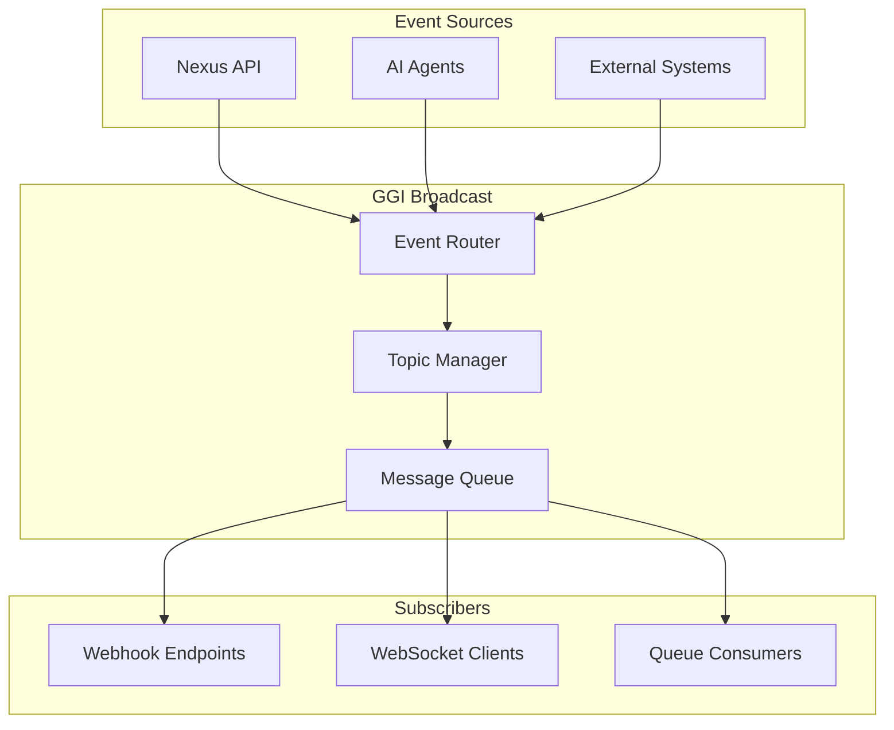

# GGI Broadcast Integration Guide

Guide for integrating the GGI (Global Gateway Interface) Broadcast system with the Nexus API for distributed event broadcasting and inter-system communication.

## Table of Contents

1. [Overview](#overview)
2. [Architecture](#architecture)
3. [Setup & Configuration](#setup--configuration)
4. [Broadcast Interface](#broadcast-interface)
5. [Webhook Integration](#webhook-integration)
6. [Event Types](#event-types)
7. [Message Format](#message-format)
8. [Security](#security)
9. [Examples](#examples)
10. [Troubleshooting](#troubleshooting)

---

## Overview

GGI Broadcast is a distributed event broadcasting system that enables:

- **Cross-platform communication**: Share events between different systems
- **Real-time updates**: Broadcast events to multiple subscribers instantly
- **Event aggregation**: Collect and route events from various sources
- **Scalable architecture**: Handle high-volume event streams
- **Reliable delivery**: Guarantee event delivery with retry mechanisms

### Use Cases

- Multi-tenant notification systems
- Distributed monitoring and alerting
- Cross-system workflow coordination
- Real-time analytics and dashboards
- AI agent collaboration networks

---

## Architecture



### Components

1. **Event Router**: Routes incoming events to appropriate topics
2. **Topic Manager**: Manages topic subscriptions and routing rules
3. **Message Queue**: Ensures reliable event delivery
4. **Delivery Manager**: Handles webhook delivery with retries

---

## Setup & Configuration

### Prerequisites

- GGI Broadcast service URL
- API credentials
- Webhook endpoint for receiving events

### Environment Variables

```bash
# GGI Broadcast Configuration
GGI_BROADCAST_URL=https://broadcast.ggi.example.com
GGI_API_KEY=ggi_broadcast_api_key_here
GGI_SECRET_KEY=ggi_webhook_secret_here

# Webhook Configuration
GGI_WEBHOOK_URL=https://nexus.example.com/webhooks/ggi
GGI_WEBHOOK_SECRET=your_webhook_secret_here

# Topic Configuration
GGI_DEFAULT_TOPICS=nexus.telemetry,nexus.tasks,nexus.ai
GGI_BROADCAST_ENABLED=true

# Retry Configuration
GGI_MAX_RETRIES=3
GGI_RETRY_DELAY=5000
GGI_RETRY_BACKOFF=exponential
```

### Installation

#### Node.js
```bash
npm install @ggi/broadcast-client
```

#### Python
```bash
pip install ggi-broadcast-client
```

---

## Broadcast Interface

### Initialize Client

#### Node.js
```javascript
const { GGIBroadcastClient } = require('@ggi/broadcast-client');

const client = new GGIBroadcastClient({
  url: process.env.GGI_BROADCAST_URL,
  apiKey: process.env.GGI_API_KEY,
  secretKey: process.env.GGI_SECRET_KEY
});
```

#### Python
```python
from ggi_broadcast_client import GGIBroadcastClient

client = GGIBroadcastClient(
    url=os.getenv('GGI_BROADCAST_URL'),
    api_key=os.getenv('GGI_API_KEY'),
    secret_key=os.getenv('GGI_SECRET_KEY')
)
```

### Publish Events

#### Single Event

**Node.js**
```javascript
await client.publish({
  topic: 'nexus.telemetry',
  event_type: 'metric.reported',
  data: {
    metric_name: 'cpu_usage',
    value: 45.2,
    source: 'server-01',
    timestamp: new Date().toISOString()
  },
  metadata: {
    priority: 'normal',
    source_system: 'nexus-api',
    correlation_id: 'req_12345'
  }
});
```

**Python**
```python
await client.publish({
    'topic': 'nexus.telemetry',
    'event_type': 'metric.reported',
    'data': {
        'metric_name': 'cpu_usage',
        'value': 45.2,
        'source': 'server-01',
        'timestamp': datetime.utcnow().isoformat()
    },
    'metadata': {
        'priority': 'normal',
        'source_system': 'nexus-api'
    }
})
```

#### Batch Events

**Node.js**
```javascript
await client.publishBatch([
  {
    topic: 'nexus.telemetry',
    event_type: 'metric.reported',
    data: { metric_name: 'cpu_usage', value: 45.2 }
  },
  {
    topic: 'nexus.telemetry',
    event_type: 'metric.reported',
    data: { metric_name: 'memory_usage', value: 62.8 }
  }
]);
```

### Subscribe to Topics

#### Register Webhook

**Node.js**
```javascript
await client.subscribe({
  topics: ['nexus.telemetry', 'nexus.tasks', 'nexus.ai'],
  webhook_url: process.env.GGI_WEBHOOK_URL,
  webhook_secret: process.env.GGI_WEBHOOK_SECRET,
  filters: {
    priority: ['high', 'critical'],
    source_system: ['nexus-api', 'ai-coordinator']
  },
  delivery_config: {
    max_retries: 3,
    retry_delay: 5000,
    timeout: 30000
  }
});
```

**Python**
```python
await client.subscribe(
    topics=['nexus.telemetry', 'nexus.tasks', 'nexus.ai'],
    webhook_url=os.getenv('GGI_WEBHOOK_URL'),
    webhook_secret=os.getenv('GGI_WEBHOOK_SECRET'),
    filters={
        'priority': ['high', 'critical'],
        'source_system': ['nexus-api', 'ai-coordinator']
    }
)
```

### List Subscriptions

```javascript
const subscriptions = await client.listSubscriptions();
console.log('Active subscriptions:', subscriptions);
```

### Unsubscribe

```javascript
await client.unsubscribe({
  subscription_id: 'sub_12345'
});
```

---

## Webhook Integration

### Webhook Handler

#### Express.js Handler

```javascript
const express = require('express');
const crypto = require('crypto');

const app = express();
app.use(express.json());

// Verify webhook signature
function verifySignature(payload, signature, secret) {
  const expectedSignature = crypto
    .createHmac('sha256', secret)
    .update(payload)
    .digest('hex');
  
  return crypto.timingSafeEqual(
    Buffer.from(signature),
    Buffer.from(`sha256=${expectedSignature}`)
  );
}

// Webhook endpoint
app.post('/webhooks/ggi', (req, res) => {
  const signature = req.headers['x-ggi-signature'];
  const payload = JSON.stringify(req.body);
  
  // Verify signature
  if (!verifySignature(payload, signature, process.env.GGI_WEBHOOK_SECRET)) {
    return res.status(401).json({ error: 'Invalid signature' });
  }
  
  // Process event
  const event = req.body;
  
  console.log('GGI Event received:', {
    topic: event.topic,
    event_type: event.event_type,
    timestamp: event.timestamp
  });
  
  // Route to appropriate handler
  switch (event.topic) {
    case 'nexus.telemetry':
      handleTelemetryEvent(event);
      break;
    
    case 'nexus.tasks':
      handleTaskEvent(event);
      break;
    
    case 'nexus.ai':
      handleAIEvent(event);
      break;
    
    default:
      console.log('Unknown topic:', event.topic);
  }
  
  // Acknowledge receipt
  res.status(200).json({
    status: 'received',
    event_id: event.event_id
  });
});

// Event handlers
async function handleTelemetryEvent(event) {
  const { data, metadata } = event;
  
  // Process telemetry data
  console.log('Processing telemetry:', data);
  
  // Store in database
  await db.telemetry.insert({
    metric_name: data.metric_name,
    value: data.value,
    source: data.source,
    timestamp: data.timestamp,
    metadata: metadata
  });
  
  // Trigger alerts if needed
  if (data.value > 90) {
    await triggerAlert({
      type: 'high_metric_value',
      metric: data.metric_name,
      value: data.value
    });
  }
}

async function handleTaskEvent(event) {
  const { data, event_type } = event;
  
  console.log('Task event:', event_type, data);
  
  // Update task status
  if (event_type === 'task.completed') {
    await notifyStakeholders(data.task_id);
  }
}

async function handleAIEvent(event) {
  const { data } = event;
  
  console.log('AI event:', data);
  
  // Process AI coordination event
  await updateAIWorkflow(data);
}

app.listen(3000, () => {
  console.log('Webhook server running on port 3000');
});
```

#### Python/Flask Handler

```python
from flask import Flask, request, jsonify
import hmac
import hashlib
import os

app = Flask(__name__)

def verify_signature(payload, signature, secret):
    expected_signature = 'sha256=' + hmac.new(
        secret.encode(),
        payload.encode(),
        hashlib.sha256
    ).hexdigest()
    
    return hmac.compare_digest(expected_signature, signature)

@app.route('/webhooks/ggi', methods=['POST'])
def handle_ggi_webhook():
    signature = request.headers.get('X-GGI-Signature')
    payload = request.get_data(as_text=True)
    
    # Verify signature
    if not verify_signature(payload, signature, os.getenv('GGI_WEBHOOK_SECRET')):
        return jsonify({'error': 'Invalid signature'}), 401
    
    # Process event
    event = request.json
    
    print(f"GGI Event received: {event['topic']} - {event['event_type']}")
    
    # Route to handler
    if event['topic'] == 'nexus.telemetry':
        handle_telemetry_event(event)
    elif event['topic'] == 'nexus.tasks':
        handle_task_event(event)
    elif event['topic'] == 'nexus.ai':
        handle_ai_event(event)
    
    return jsonify({'status': 'received', 'event_id': event['event_id']}), 200

if __name__ == '__main__':
    app.run(port=3000)
```

---

## Event Types

### Telemetry Events

| Event Type | Description |
|------------|-------------|
| `metric.reported` | New metric data reported |
| `metric.threshold_exceeded` | Metric exceeded threshold |
| `metric.anomaly_detected` | Anomaly detected in metrics |

### Task Events

| Event Type | Description |
|------------|-------------|
| `task.created` | New task created |
| `task.updated` | Task status or details updated |
| `task.completed` | Task completed successfully |
| `task.failed` | Task failed |
| `task.assigned` | Task assigned to agent |

### AI Events

| Event Type | Description |
|------------|-------------|
| `ai.request_created` | AI assistance request created |
| `ai.request_completed` | AI request completed |
| `ai.agent_registered` | New AI agent registered |
| `ai.workflow_started` | Multi-agent workflow started |
| `ai.workflow_completed` | Workflow completed |

### Command Events

| Event Type | Description |
|------------|-------------|
| `command.executed` | Command executed successfully |
| `command.failed` | Command execution failed |
| `command.queued` | Command queued for execution |

---

## Message Format

### Standard Event Structure

```json
{
  "event_id": "evt_550e8400",
  "topic": "nexus.telemetry",
  "event_type": "metric.reported",
  "timestamp": "2025-11-03T01:54:00.000Z",
  "data": {
    "metric_name": "cpu_usage",
    "value": 45.2,
    "source": "server-01",
    "unit": "percent"
  },
  "metadata": {
    "priority": "normal",
    "source_system": "nexus-api",
    "correlation_id": "req_12345",
    "user_id": "user_123",
    "tenant_id": "tenant_456"
  },
  "delivery_info": {
    "attempt": 1,
    "max_attempts": 3,
    "next_retry": null
  }
}
```

### Webhook Delivery Headers

```http
POST /webhooks/ggi HTTP/1.1
Host: nexus.example.com
Content-Type: application/json
X-GGI-Signature: sha256=abcdef1234567890...
X-GGI-Delivery: delivery_550e8400
X-GGI-Event: metric.reported
X-GGI-Topic: nexus.telemetry
X-GGI-Timestamp: 2025-11-03T01:54:00.000Z
```

---

## Security

### Signature Verification

Always verify webhook signatures:

```javascript
const crypto = require('crypto');

function verifyWebhookSignature(payload, signature, secret) {
  const expectedSignature = 'sha256=' + crypto
    .createHmac('sha256', secret)
    .update(payload)
    .digest('hex');
  
  return crypto.timingSafeEqual(
    Buffer.from(signature),
    Buffer.from(expectedSignature)
  );
}
```

### API Key Rotation

```javascript
// Rotate API key
await client.rotateApiKey({
  current_key: process.env.GGI_API_KEY,
  new_key: generateSecureKey()
});
```

### Rate Limiting

GGI Broadcast enforces rate limits:

- Publishing: 1000 events/minute per API key
- Subscriptions: 100 operations/minute
- Webhook delivery: 10000 events/minute per endpoint

---

## Examples

### Complete Integration Example

```javascript
const { GGIBroadcastClient } = require('@ggi/broadcast-client');
const { NexusClient } = require('@nexus/client');

class NexusGGIIntegration {
  constructor() {
    this.ggi = new GGIBroadcastClient({
      url: process.env.GGI_BROADCAST_URL,
      apiKey: process.env.GGI_API_KEY
    });
    
    this.nexus = new NexusClient({
      apiKey: process.env.NEXUS_API_KEY
    });
  }

  async initialize() {
    // Subscribe to GGI topics
    await this.ggi.subscribe({
      topics: ['nexus.telemetry', 'nexus.tasks', 'nexus.ai'],
      webhook_url: process.env.GGI_WEBHOOK_URL,
      webhook_secret: process.env.GGI_WEBHOOK_SECRET
    });
    
    console.log('GGI Broadcast integration initialized');
  }

  async publishTelemetry(metric) {
    // Submit to Nexus
    const result = await this.nexus.telemetry.submit(metric);
    
    // Broadcast to GGI
    await this.ggi.publish({
      topic: 'nexus.telemetry',
      event_type: 'metric.reported',
      data: metric,
      metadata: {
        nexus_event_id: result.event_id,
        priority: metric.priority || 'normal'
      }
    });
  }

  async publishTaskUpdate(task) {
    // Update task in Nexus
    await this.nexus.tasks.update(task.task_id, task);
    
    // Broadcast to GGI
    await this.ggi.publish({
      topic: 'nexus.tasks',
      event_type: `task.${task.status}`,
      data: task
    });
  }

  async handleGGIEvent(event) {
    switch (event.topic) {
      case 'nexus.telemetry':
        await this.handleTelemetryBroadcast(event);
        break;
      
      case 'nexus.tasks':
        await this.handleTaskBroadcast(event);
        break;
      
      case 'nexus.ai':
        await this.handleAIBroadcast(event);
        break;
    }
  }

  async handleTelemetryBroadcast(event) {
    // Process telemetry broadcast from other systems
    console.log('External telemetry:', event.data);
    
    // Optionally store or forward
    if (event.metadata.priority === 'critical') {
      await this.triggerAlert(event);
    }
  }
}

// Usage
const integration = new NexusGGIIntegration();
await integration.initialize();

// Publish events
await integration.publishTelemetry({
  metric_name: 'cpu_usage',
  value: 85.5,
  source: 'server-01',
  priority: 'high'
});
```

---

## Troubleshooting

### Common Issues

#### 1. Signature Verification Fails

**Problem**: Webhook signature validation fails

**Solutions**:
- Verify webhook secret matches
- Ensure raw body is used for verification (not parsed JSON)
- Check timestamp tolerance (events older than 5 minutes rejected)
- Verify signature format: `sha256=<hash>`

#### 2. Events Not Received

**Problem**: Subscribed events not arriving at webhook

**Solutions**:
- Verify webhook URL is publicly accessible
- Check webhook endpoint returns 200 OK
- Verify subscription is active: `await client.listSubscriptions()`
- Check firewall/security group allows inbound traffic
- Review GGI delivery logs

#### 3. High Latency

**Problem**: Events delayed or slow delivery

**Solutions**:
- Check network latency to GGI service
- Verify webhook endpoint response time < 5s
- Use batch publishing for high-volume events
- Consider using direct WebSocket connection
- Review retry configuration

#### 4. Rate Limiting

**Problem**: Requests throttled or rejected

**Solutions**:
- Implement exponential backoff
- Use batch operations
- Distribute load across multiple API keys
- Contact GGI support for limit increase

---

## Best Practices

1. **Always verify signatures**: Never skip signature verification
2. **Handle retries gracefully**: Make webhook handlers idempotent
3. **Use batch operations**: For high-volume scenarios
4. **Monitor delivery**: Track webhook delivery success rates
5. **Implement circuit breakers**: Prevent cascade failures
6. **Log extensively**: Log all events for debugging
7. **Use correlation IDs**: Track events across systems

---

## Next Steps

- Review [NEXUS_API_SPEC.md](./NEXUS_API_SPEC.md) for API details
- Set up [WEBSOCKET_EXAMPLE.md](./WEBSOCKET_EXAMPLE.md) for real-time streaming
- Implement [SECURITY_RUNBOOK.md](./SECURITY_RUNBOOK.md) best practices

---

**Need Help?** Contact GGI Broadcast support or Nexus support team.
