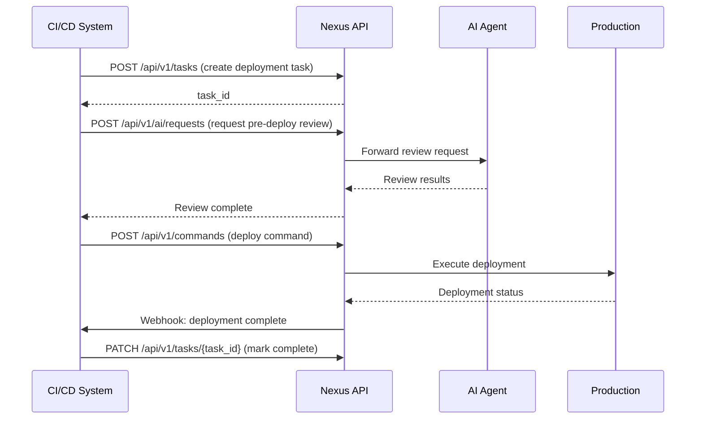
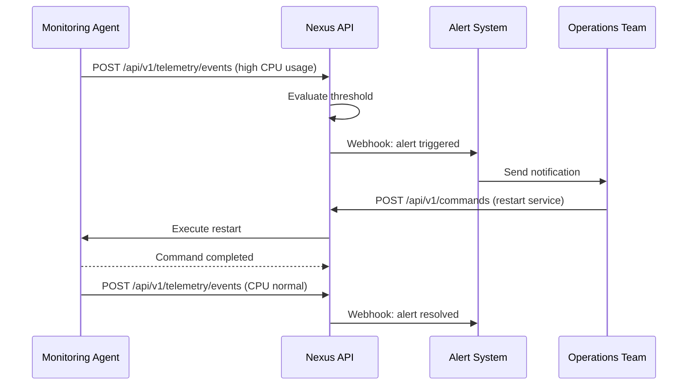
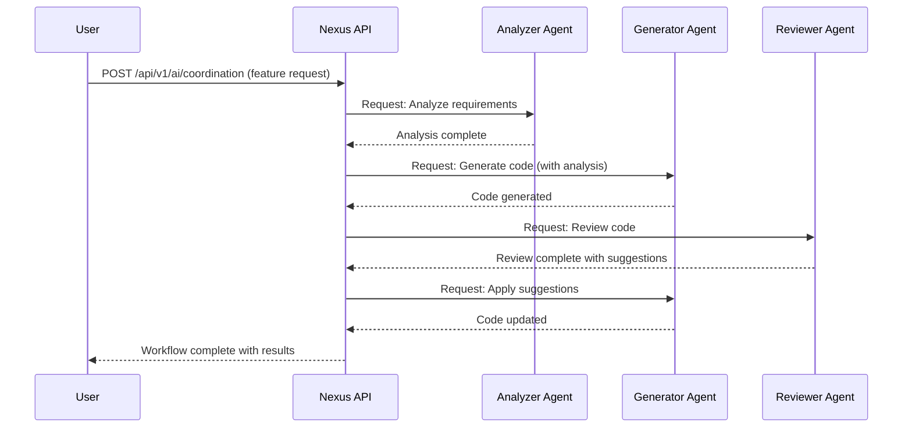

# Nexus API Specification

**Version**: 1.0.0  
**Last Updated**: 2025-11-03  
**Status**: Draft

## Overview

The Nexus API provides a comprehensive interface for telemetry collection, command execution, task management, AI coordination, security enforcement, and event streaming. This specification defines the core endpoints, data models, authentication mechanisms, and interaction patterns for the Nexus ecosystem.

## Table of Contents

1. [Authentication & Security](#authentication--security)
2. [Core Concepts](#core-concepts)
3. [Telemetry API](#telemetry-api)
4. [Command API](#command-api)
5. [Task Management API](#task-management-api)
6. [AI Coordination API](#ai-coordination-api)
7. [Security & Access Control](#security--access-control)
8. [Event Streaming](#event-streaming)
9. [Webhooks](#webhooks)
10. [Example Workflows](#example-workflows)
11. [Error Handling](#error-handling)
12. [Rate Limiting](#rate-limiting)

---

## Authentication & Security

### Authentication Methods

Nexus supports multiple authentication methods:

1. **API Keys**: For service-to-service communication
2. **OAuth 2.0**: For user-delegated access (e.g., Gmail integration)
3. **JWT Tokens**: For session-based authentication
4. **Webhook Signatures**: For validating webhook payloads

### API Key Authentication

```http
Authorization: Bearer <API_KEY>
```

API keys should be stored in environment variables:
```
NEXUS_API_KEY=your_api_key_here
```

### OAuth 2.0 Flow

For Gmail and other third-party integrations:

1. Redirect user to OAuth consent screen
2. Handle callback with authorization code
3. Exchange code for access token
4. Use access token for API requests
5. Refresh token when expired

See [GMAIL_OAUTH_SETUP.md](./GMAIL_OAUTH_SETUP.md) for detailed setup.

### JWT Token Structure

```json
{
  "header": {
    "alg": "HS256",
    "typ": "JWT"
  },
  "payload": {
    "sub": "user_id",
    "exp": 1699000000,
    "iat": 1698990000,
    "roles": ["admin", "developer"],
    "scopes": ["telemetry:read", "command:write"]
  }
}
```

---

## Core Concepts

### Resource Identifiers

All resources use UUIDs (v4) for identification:
```
resource_id: "550e8400-e29b-41d4-a716-446655440000"
```

### Timestamps

All timestamps are in ISO 8601 format with UTC timezone:
```
timestamp: "2025-11-03T01:54:00.000Z"
```

### Status Codes

Standard HTTP status codes are used:
- `200 OK`: Successful request
- `201 Created`: Resource created successfully
- `202 Accepted`: Request accepted for processing
- `400 Bad Request`: Invalid request parameters
- `401 Unauthorized`: Authentication required
- `403 Forbidden`: Insufficient permissions
- `404 Not Found`: Resource not found
- `429 Too Many Requests`: Rate limit exceeded
- `500 Internal Server Error`: Server error
- `503 Service Unavailable`: Service temporarily unavailable

---

## Telemetry API

### Submit Telemetry Event

Submit a telemetry event to the Nexus system.

**Endpoint**: `POST /api/v1/telemetry/events`

**Request Headers**:
```http
Content-Type: application/json
Authorization: Bearer <API_KEY>
```

**Request Body**:
```json
{
  "event_type": "system.metric",
  "source": "agent_001",
  "timestamp": "2025-11-03T01:54:00.000Z",
  "data": {
    "metric_name": "cpu_usage",
    "value": 45.2,
    "unit": "percent",
    "tags": {
      "host": "server-01",
      "environment": "production"
    }
  },
  "metadata": {
    "version": "1.0.0",
    "schema": "metric_v1"
  }
}
```

**Response** (201 Created):
```json
{
  "event_id": "550e8400-e29b-41d4-a716-446655440000",
  "status": "accepted",
  "timestamp": "2025-11-03T01:54:00.123Z"
}
```

### Query Telemetry Data

Query historical telemetry data with filters.

**Endpoint**: `GET /api/v1/telemetry/events`

**Query Parameters**:
- `event_type` (string): Filter by event type
- `source` (string): Filter by source identifier
- `from` (ISO 8601): Start time for query range
- `to` (ISO 8601): End time for query range
- `limit` (integer): Maximum results (default: 100, max: 1000)
- `offset` (integer): Pagination offset

**Example Request**:
```http
GET /api/v1/telemetry/events?event_type=system.metric&source=agent_001&from=2025-11-03T00:00:00Z&limit=50
```

**Response** (200 OK):
```json
{
  "events": [
    {
      "event_id": "550e8400-e29b-41d4-a716-446655440000",
      "event_type": "system.metric",
      "source": "agent_001",
      "timestamp": "2025-11-03T01:54:00.000Z",
      "data": {
        "metric_name": "cpu_usage",
        "value": 45.2,
        "unit": "percent"
      }
    }
  ],
  "pagination": {
    "total": 150,
    "limit": 50,
    "offset": 0,
    "has_more": true
  }
}
```

### Batch Telemetry Submission

Submit multiple telemetry events in a single request.

**Endpoint**: `POST /api/v1/telemetry/batch`

**Request Body**:
```json
{
  "events": [
    {
      "event_type": "system.metric",
      "source": "agent_001",
      "timestamp": "2025-11-03T01:54:00.000Z",
      "data": { "metric_name": "cpu_usage", "value": 45.2 }
    },
    {
      "event_type": "system.metric",
      "source": "agent_001",
      "timestamp": "2025-11-03T01:54:01.000Z",
      "data": { "metric_name": "memory_usage", "value": 62.8 }
    }
  ]
}
```

**Response** (202 Accepted):
```json
{
  "batch_id": "batch_550e8400",
  "status": "processing",
  "accepted_count": 2,
  "rejected_count": 0
}
```

---

## Command API

### Execute Command

Execute a command on a target agent or system.

**Endpoint**: `POST /api/v1/commands`

**Request Body**:
```json
{
  "command_type": "system.restart",
  "target": "agent_001",
  "parameters": {
    "delay_seconds": 30,
    "force": false
  },
  "priority": "normal",
  "timeout_seconds": 300,
  "callback_url": "https://example.com/webhooks/command-result"
}
```

**Response** (201 Created):
```json
{
  "command_id": "cmd_550e8400",
  "status": "queued",
  "created_at": "2025-11-03T01:54:00.000Z",
  "estimated_completion": "2025-11-03T01:59:00.000Z"
}
```

### Get Command Status

Check the status of a previously submitted command.

**Endpoint**: `GET /api/v1/commands/{command_id}`

**Response** (200 OK):
```json
{
  "command_id": "cmd_550e8400",
  "command_type": "system.restart",
  "target": "agent_001",
  "status": "completed",
  "result": {
    "success": true,
    "message": "System restarted successfully",
    "output": "Restart completed at 2025-11-03T01:55:00.000Z"
  },
  "created_at": "2025-11-03T01:54:00.000Z",
  "completed_at": "2025-11-03T01:55:00.000Z"
}
```

### Cancel Command

Cancel a pending or running command.

**Endpoint**: `DELETE /api/v1/commands/{command_id}`

**Response** (200 OK):
```json
{
  "command_id": "cmd_550e8400",
  "status": "cancelled",
  "cancelled_at": "2025-11-03T01:54:30.000Z"
}
```

---

## Task Management API

### Create Task

Create a new task in the system.

**Endpoint**: `POST /api/v1/tasks`

**Request Body**:
```json
{
  "title": "Deploy new feature",
  "description": "Deploy feature XYZ to production environment",
  "type": "deployment",
  "priority": "high",
  "assignee": "ai_agent_001",
  "due_date": "2025-11-05T00:00:00.000Z",
  "tags": ["deployment", "production", "feature-xyz"],
  "metadata": {
    "environment": "production",
    "feature_id": "xyz-123"
  }
}
```

**Response** (201 Created):
```json
{
  "task_id": "task_550e8400",
  "status": "pending",
  "created_at": "2025-11-03T01:54:00.000Z",
  "created_by": "user_123"
}
```

### Get Task Details

Retrieve details of a specific task.

**Endpoint**: `GET /api/v1/tasks/{task_id}`

**Response** (200 OK):
```json
{
  "task_id": "task_550e8400",
  "title": "Deploy new feature",
  "description": "Deploy feature XYZ to production environment",
  "type": "deployment",
  "priority": "high",
  "status": "in_progress",
  "assignee": "ai_agent_001",
  "created_at": "2025-11-03T01:54:00.000Z",
  "updated_at": "2025-11-03T02:00:00.000Z",
  "due_date": "2025-11-05T00:00:00.000Z",
  "progress": 45,
  "subtasks": [
    {
      "subtask_id": "subtask_001",
      "title": "Run pre-deployment checks",
      "status": "completed"
    },
    {
      "subtask_id": "subtask_002",
      "title": "Deploy to staging",
      "status": "in_progress"
    }
  ]
}
```

### Update Task

Update an existing task.

**Endpoint**: `PATCH /api/v1/tasks/{task_id}`

**Request Body**:
```json
{
  "status": "in_progress",
  "progress": 45,
  "notes": "Deployment to staging in progress"
}
```

**Response** (200 OK):
```json
{
  "task_id": "task_550e8400",
  "status": "in_progress",
  "updated_at": "2025-11-03T02:00:00.000Z"
}
```

### List Tasks

List tasks with optional filters.

**Endpoint**: `GET /api/v1/tasks`

**Query Parameters**:
- `status` (string): Filter by status (pending, in_progress, completed, failed)
- `assignee` (string): Filter by assignee
- `priority` (string): Filter by priority (low, normal, high, critical)
- `type` (string): Filter by task type
- `tags` (array): Filter by tags
- `limit` (integer): Results per page
- `offset` (integer): Pagination offset

**Response** (200 OK):
```json
{
  "tasks": [
    {
      "task_id": "task_550e8400",
      "title": "Deploy new feature",
      "status": "in_progress",
      "priority": "high",
      "created_at": "2025-11-03T01:54:00.000Z"
    }
  ],
  "pagination": {
    "total": 25,
    "limit": 10,
    "offset": 0,
    "has_more": true
  }
}
```

---

## AI Coordination API

### Register AI Agent

Register a new AI agent with the Nexus system.

**Endpoint**: `POST /api/v1/ai/agents`

**Request Body**:
```json
{
  "agent_name": "CodeAssistant_v1",
  "agent_type": "code_generation",
  "capabilities": [
    "code_review",
    "bug_detection",
    "documentation_generation"
  ],
  "version": "1.0.0",
  "endpoint": "https://ai-agent.example.com/api",
  "authentication": {
    "type": "api_key",
    "key_reference": "AGENT_API_KEY_ENV"
  }
}
```

**Response** (201 Created):
```json
{
  "agent_id": "agent_550e8400",
  "status": "active",
  "registered_at": "2025-11-03T01:54:00.000Z",
  "api_key": "nexus_agent_xxxxxxxxxx"
}
```

### Request AI Assistance

Request assistance from an AI agent.

**Endpoint**: `POST /api/v1/ai/requests`

**Request Body**:
```json
{
  "request_type": "code_review",
  "target_agent": "agent_550e8400",
  "priority": "normal",
  "context": {
    "repository": "github.com/example/repo",
    "pull_request": 42,
    "files": ["src/main.py", "src/utils.py"]
  },
  "parameters": {
    "check_security": true,
    "check_style": true,
    "check_performance": true
  }
}
```

**Response** (202 Accepted):
```json
{
  "request_id": "req_550e8400",
  "status": "processing",
  "estimated_completion": "2025-11-03T02:00:00.000Z",
  "callback_url": "/api/v1/ai/requests/req_550e8400/result"
}
```

### Get AI Request Result

Retrieve the result of an AI assistance request.

**Endpoint**: `GET /api/v1/ai/requests/{request_id}/result`

**Response** (200 OK):
```json
{
  "request_id": "req_550e8400",
  "status": "completed",
  "result": {
    "findings": [
      {
        "type": "security",
        "severity": "high",
        "file": "src/main.py",
        "line": 42,
        "message": "Potential SQL injection vulnerability",
        "suggestion": "Use parameterized queries"
      },
      {
        "type": "style",
        "severity": "low",
        "file": "src/utils.py",
        "line": 15,
        "message": "Function name should be snake_case",
        "suggestion": "Rename camelCase to snake_case"
      }
    ],
    "summary": {
      "total_issues": 2,
      "critical": 0,
      "high": 1,
      "medium": 0,
      "low": 1
    }
  },
  "completed_at": "2025-11-03T01:58:00.000Z"
}
```

### Agent Coordination

Coordinate multiple AI agents for complex tasks.

**Endpoint**: `POST /api/v1/ai/coordination`

**Request Body**:
```json
{
  "workflow_type": "multi_agent_task",
  "agents": [
    {
      "agent_id": "agent_001",
      "role": "analyzer",
      "sequence": 1
    },
    {
      "agent_id": "agent_002",
      "role": "generator",
      "sequence": 2,
      "depends_on": ["agent_001"]
    },
    {
      "agent_id": "agent_003",
      "role": "reviewer",
      "sequence": 3,
      "depends_on": ["agent_002"]
    }
  ],
  "context": {
    "task_type": "feature_development",
    "requirements": "Implement user authentication"
  }
}
```

**Response** (202 Accepted):
```json
{
  "workflow_id": "wf_550e8400",
  "status": "orchestrating",
  "created_at": "2025-11-03T01:54:00.000Z",
  "estimated_completion": "2025-11-03T03:00:00.000Z"
}
```

---

## Security & Access Control

### Role-Based Access Control (RBAC)

Nexus implements fine-grained RBAC with the following default roles:

- **Admin**: Full system access
- **Developer**: Read/write access to development resources
- **Operator**: Read access to telemetry, write access to commands
- **Viewer**: Read-only access

### Permission Scopes

```
telemetry:read        - Read telemetry data
telemetry:write       - Submit telemetry events
command:read          - View command status
command:write         - Execute commands
task:read             - View tasks
task:write            - Create and update tasks
ai:read               - View AI agent information
ai:write              - Register and manage AI agents
security:admin        - Manage security policies
```

### Create Access Token

**Endpoint**: `POST /api/v1/security/tokens`

**Request Body**:
```json
{
  "name": "CI/CD Pipeline Token",
  "scopes": ["telemetry:write", "task:read"],
  "expires_in_days": 90
}
```

**Response** (201 Created):
```json
{
  "token_id": "token_550e8400",
  "token": "nexus_tok_xxxxxxxxxxxxxxxxxx",
  "expires_at": "2026-02-01T01:54:00.000Z",
  "scopes": ["telemetry:write", "task:read"]
}
```

### Revoke Access Token

**Endpoint**: `DELETE /api/v1/security/tokens/{token_id}`

**Response** (200 OK):
```json
{
  "token_id": "token_550e8400",
  "status": "revoked",
  "revoked_at": "2025-11-03T01:54:00.000Z"
}
```

### Audit Log

All API requests are logged for security and compliance.

**Endpoint**: `GET /api/v1/security/audit`

**Response** (200 OK):
```json
{
  "entries": [
    {
      "timestamp": "2025-11-03T01:54:00.000Z",
      "user_id": "user_123",
      "action": "POST /api/v1/commands",
      "resource_id": "cmd_550e8400",
      "ip_address": "192.168.1.100",
      "user_agent": "NexusClient/1.0",
      "status_code": 201
    }
  ]
}
```

---

## Event Streaming

### WebSocket Connection

Establish a WebSocket connection for real-time event streaming.

**Endpoint**: `wss://nexus.example.com/api/v1/stream`

**Connection Headers**:
```
Authorization: Bearer <API_KEY>
```

**Subscribe to Events**:
```json
{
  "action": "subscribe",
  "channels": ["telemetry.metrics", "tasks.updates", "commands.status"],
  "filters": {
    "source": "agent_001",
    "priority": ["high", "critical"]
  }
}
```

**Server Response**:
```json
{
  "type": "subscription_confirmed",
  "channels": ["telemetry.metrics", "tasks.updates", "commands.status"],
  "subscription_id": "sub_550e8400"
}
```

**Event Message**:
```json
{
  "type": "event",
  "channel": "telemetry.metrics",
  "timestamp": "2025-11-03T01:54:00.000Z",
  "data": {
    "event_type": "system.metric",
    "source": "agent_001",
    "metric_name": "cpu_usage",
    "value": 45.2
  }
}
```

See [WEBSOCKET_EXAMPLE.md](./WEBSOCKET_EXAMPLE.md) for implementation examples.

---

## Webhooks

### Register Webhook

Register a webhook endpoint to receive event notifications.

**Endpoint**: `POST /api/v1/webhooks`

**Request Body**:
```json
{
  "url": "https://example.com/webhooks/nexus",
  "events": ["task.completed", "command.failed", "telemetry.alert"],
  "secret": "webhook_secret_key",
  "active": true,
  "retry_config": {
    "max_retries": 3,
    "retry_delay_seconds": 60
  }
}
```

**Response** (201 Created):
```json
{
  "webhook_id": "webhook_550e8400",
  "status": "active",
  "created_at": "2025-11-03T01:54:00.000Z"
}
```

### Webhook Payload

Webhook payloads are signed with HMAC-SHA256:

**Headers**:
```http
X-Nexus-Signature: sha256=<signature>
X-Nexus-Delivery: <delivery_id>
X-Nexus-Event: task.completed
```

**Payload**:
```json
{
  "event_type": "task.completed",
  "timestamp": "2025-11-03T01:54:00.000Z",
  "data": {
    "task_id": "task_550e8400",
    "title": "Deploy new feature",
    "status": "completed",
    "completed_at": "2025-11-03T01:54:00.000Z"
  }
}
```

**Signature Verification** (Python):
```python
import hmac
import hashlib

def verify_webhook_signature(payload, signature, secret):
    expected_signature = "sha256=" + hmac.new(
        secret.encode(),
        payload.encode(),
        hashlib.sha256
    ).hexdigest()
    return hmac.compare_digest(expected_signature, signature)
```

See [GGI_BROADCAST_INTEGRATION.md](./GGI_BROADCAST_INTEGRATION.md) for broadcast integration examples.

---

## Example Workflows

### Workflow 1: Automated Deployment Pipeline



### Workflow 2: Real-Time Monitoring Alert



### Workflow 3: Multi-Agent Collaboration



---

## Error Handling

### Error Response Format

All error responses follow a consistent format:

```json
{
  "error": {
    "code": "VALIDATION_ERROR",
    "message": "Invalid request parameters",
    "details": [
      {
        "field": "priority",
        "issue": "Must be one of: low, normal, high, critical"
      }
    ],
    "request_id": "req_550e8400",
    "timestamp": "2025-11-03T01:54:00.000Z"
  }
}
```

### Common Error Codes

| Code | HTTP Status | Description |
|------|-------------|-------------|
| `AUTHENTICATION_FAILED` | 401 | Invalid or missing authentication credentials |
| `AUTHORIZATION_FAILED` | 403 | Insufficient permissions for requested resource |
| `VALIDATION_ERROR` | 400 | Request validation failed |
| `RESOURCE_NOT_FOUND` | 404 | Requested resource does not exist |
| `RATE_LIMIT_EXCEEDED` | 429 | Too many requests in time window |
| `INTERNAL_ERROR` | 500 | Internal server error |
| `SERVICE_UNAVAILABLE` | 503 | Service temporarily unavailable |
| `TIMEOUT` | 504 | Request timeout |

### Retry Strategy

For transient errors (5xx status codes), implement exponential backoff:

```python
import time
import requests

def api_request_with_retry(url, max_retries=3):
    for attempt in range(max_retries):
        try:
            response = requests.post(url)
            if response.status_code < 500:
                return response
            
            # Exponential backoff: 1s, 2s, 4s
            wait_time = 2 ** attempt
            time.sleep(wait_time)
        except requests.exceptions.RequestException as e:
            if attempt == max_retries - 1:
                raise
            time.sleep(2 ** attempt)
    
    raise Exception("Max retries exceeded")
```

---

## Rate Limiting

### Rate Limit Headers

All API responses include rate limit information:

```http
X-RateLimit-Limit: 1000
X-RateLimit-Remaining: 995
X-RateLimit-Reset: 1699000000
```

### Default Limits

| Endpoint Category | Limit | Window |
|------------------|-------|--------|
| Telemetry (single) | 1000 req/min | 1 minute |
| Telemetry (batch) | 100 req/min | 1 minute |
| Commands | 100 req/min | 1 minute |
| Tasks | 500 req/min | 1 minute |
| AI Requests | 50 req/min | 1 minute |
| Webhooks | 1000 req/hour | 1 hour |

### Rate Limit Exceeded Response

```json
{
  "error": {
    "code": "RATE_LIMIT_EXCEEDED",
    "message": "Rate limit exceeded",
    "retry_after": 60,
    "limit": 1000,
    "window": "1 minute"
  }
}
```

---

## Versioning

The API uses URL versioning:
- Current version: `/api/v1/...`
- Future versions: `/api/v2/...`

Version deprecation will be announced 6 months in advance.

---

## Support & Resources

- **Documentation**: https://docs.nexus.example.com
- **API Status**: https://status.nexus.example.com
- **Community Forum**: https://community.nexus.example.com
- **Support Email**: support@nexus.example.com

---

## Changelog

### Version 1.0.0 (2025-11-03)
- Initial API specification
- Core endpoints for telemetry, commands, tasks, and AI coordination
- Authentication and security framework
- WebSocket streaming support
- Webhook system

---

**End of Specification**
