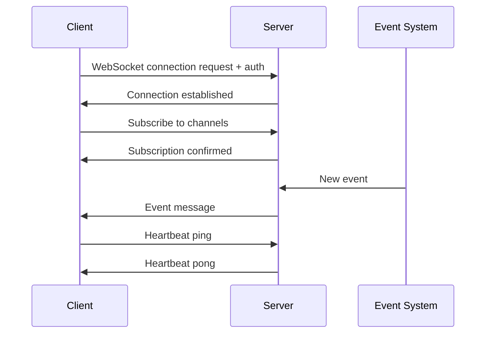

# WebSocket Implementation Examples

This guide provides comprehensive examples for implementing WebSocket connections for bidirectional, real-time messaging with the Nexus API.

## Table of Contents

1. [Overview](#overview)
2. [Server Implementation](#server-implementation)
3. [Client Implementation](#client-implementation)
4. [Message Protocol](#message-protocol)
5. [Authentication](#authentication)
6. [Event Subscription](#event-subscription)
7. [Error Handling](#error-handling)
8. [Production Considerations](#production-considerations)

---

## Overview

WebSocket connections enable real-time, bidirectional communication between clients and the Nexus API server. Use cases include:

- Real-time telemetry streaming
- Live task status updates
- Command execution monitoring
- AI agent coordination events
- System alerts and notifications

### WebSocket Flow



---

## Server Implementation

### Node.js WebSocket Server

#### Installation

```bash
npm install ws express dotenv
```

#### Basic Server Setup

**`server.js`**
```javascript
const WebSocket = require('ws');
const http = require('http');
const express = require('express');
require('dotenv').config();

const app = express();
const server = http.createServer(app);
const wss = new WebSocket.Server({ server });

// Store active connections
const clients = new Map();

// Authentication middleware
function authenticateClient(request) {
  const token = request.headers.authorization?.replace('Bearer ', '');
  
  if (!token) {
    throw new Error('Missing authentication token');
  }
  
  // Verify token (implement your auth logic)
  // For example, verify JWT or API key
  const isValid = verifyToken(token);
  
  if (!isValid) {
    throw new Error('Invalid token');
  }
  
  return { userId: 'user_123', token };
}

function verifyToken(token) {
  // Implement token verification
  // Return true if valid, false otherwise
  return token === process.env.NEXUS_API_KEY;
}

// WebSocket connection handler
wss.on('connection', (ws, request) => {
  let clientId;
  
  try {
    // Authenticate client
    const auth = authenticateClient(request);
    clientId = `client_${Date.now()}_${Math.random()}`;
    
    // Store client connection
    clients.set(clientId, {
      ws,
      userId: auth.userId,
      subscriptions: new Set(),
      createdAt: Date.now()
    });
    
    console.log(`Client ${clientId} connected`);
    
    // Send welcome message
    ws.send(JSON.stringify({
      type: 'connection_established',
      client_id: clientId,
      timestamp: new Date().toISOString()
    }));
    
    // Handle incoming messages
    ws.on('message', (data) => {
      handleMessage(clientId, data);
    });
    
    // Handle client disconnect
    ws.on('close', () => {
      console.log(`Client ${clientId} disconnected`);
      clients.delete(clientId);
    });
    
    // Handle errors
    ws.on('error', (error) => {
      console.error(`WebSocket error for ${clientId}:`, error);
    });
    
  } catch (error) {
    console.error('Authentication failed:', error.message);
    ws.close(1008, error.message); // Policy violation
  }
});

// Handle incoming messages
function handleMessage(clientId, data) {
  const client = clients.get(clientId);
  if (!client) return;
  
  try {
    const message = JSON.parse(data);
    
    switch (message.action) {
      case 'subscribe':
        handleSubscribe(clientId, message);
        break;
      
      case 'unsubscribe':
        handleUnsubscribe(clientId, message);
        break;
      
      case 'ping':
        handlePing(clientId);
        break;
      
      default:
        client.ws.send(JSON.stringify({
          type: 'error',
          message: `Unknown action: ${message.action}`
        }));
    }
  } catch (error) {
    console.error(`Error handling message from ${clientId}:`, error);
    client.ws.send(JSON.stringify({
      type: 'error',
      message: 'Invalid message format'
    }));
  }
}

// Handle channel subscription
function handleSubscribe(clientId, message) {
  const client = clients.get(clientId);
  if (!client) return;
  
  const { channels, filters } = message;
  
  // Validate channels
  const validChannels = [
    'telemetry.metrics',
    'telemetry.events',
    'tasks.updates',
    'tasks.created',
    'commands.status',
    'ai.requests',
    'system.alerts'
  ];
  
  const invalidChannels = channels.filter(ch => !validChannels.includes(ch));
  
  if (invalidChannels.length > 0) {
    client.ws.send(JSON.stringify({
      type: 'subscription_error',
      message: `Invalid channels: ${invalidChannels.join(', ')}`
    }));
    return;
  }
  
  // Add channels to subscriptions
  channels.forEach(channel => {
    client.subscriptions.add(JSON.stringify({ channel, filters }));
  });
  
  // Send confirmation
  client.ws.send(JSON.stringify({
    type: 'subscription_confirmed',
    channels,
    filters,
    subscription_id: `sub_${Date.now()}`
  }));
  
  console.log(`Client ${clientId} subscribed to:`, channels);
}

// Handle channel unsubscription
function handleUnsubscribe(clientId, message) {
  const client = clients.get(clientId);
  if (!client) return;
  
  const { channels } = message;
  
  channels.forEach(channel => {
    // Remove all subscriptions for this channel
    Array.from(client.subscriptions).forEach(sub => {
      const parsed = JSON.parse(sub);
      if (parsed.channel === channel) {
        client.subscriptions.delete(sub);
      }
    });
  });
  
  client.ws.send(JSON.stringify({
    type: 'unsubscription_confirmed',
    channels
  }));
  
  console.log(`Client ${clientId} unsubscribed from:`, channels);
}

// Handle ping
function handlePing(clientId) {
  const client = clients.get(clientId);
  if (!client) return;
  
  client.ws.send(JSON.stringify({
    type: 'pong',
    timestamp: new Date().toISOString()
  }));
}

// Broadcast event to subscribed clients
function broadcastEvent(channel, event) {
  clients.forEach((client, clientId) => {
    // Check if client is subscribed to this channel
    const isSubscribed = Array.from(client.subscriptions).some(sub => {
      const parsed = JSON.parse(sub);
      
      if (parsed.channel !== channel) return false;
      
      // Apply filters if any
      if (parsed.filters) {
        return matchesFilters(event, parsed.filters);
      }
      
      return true;
    });
    
    if (isSubscribed) {
      try {
        client.ws.send(JSON.stringify({
          type: 'event',
          channel,
          timestamp: new Date().toISOString(),
          data: event
        }));
      } catch (error) {
        console.error(`Error sending to ${clientId}:`, error);
      }
    }
  });
}

// Check if event matches filters
function matchesFilters(event, filters) {
  for (const [key, value] of Object.entries(filters)) {
    if (Array.isArray(value)) {
      if (!value.includes(event[key])) return false;
    } else {
      if (event[key] !== value) return false;
    }
  }
  return true;
}

// Heartbeat to keep connections alive
setInterval(() => {
  clients.forEach((client, clientId) => {
    if (client.ws.readyState === WebSocket.OPEN) {
      client.ws.ping();
    } else {
      clients.delete(clientId);
    }
  });
}, 30000); // Every 30 seconds

// Example: Simulate events (in production, these come from your event system)
setInterval(() => {
  broadcastEvent('telemetry.metrics', {
    event_type: 'system.metric',
    source: 'server-01',
    metric_name: 'cpu_usage',
    value: Math.random() * 100,
    timestamp: new Date().toISOString()
  });
}, 5000);

// Start server
const PORT = process.env.PORT || 3000;
server.listen(PORT, () => {
  console.log(`WebSocket server running on port ${PORT}`);
  console.log(`ws://localhost:${PORT}`);
});

// Graceful shutdown
process.on('SIGTERM', () => {
  console.log('SIGTERM received, closing server...');
  
  // Close all client connections
  clients.forEach((client, clientId) => {
    client.ws.close(1000, 'Server shutting down');
  });
  
  wss.close(() => {
    server.close(() => {
      console.log('Server closed');
      process.exit(0);
    });
  });
});

// Export for use in other modules
module.exports = { broadcastEvent };
```

---

## Client Implementation

### Node.js WebSocket Client

**Installation**
```bash
npm install ws
```

**`client.js`**
```javascript
const WebSocket = require('ws');

class NexusWebSocketClient {
  constructor(options) {
    this.url = options.url || 'ws://localhost:3000';
    this.apiKey = options.apiKey;
    this.ws = null;
    this.reconnectInterval = options.reconnectInterval || 5000;
    this.maxReconnectAttempts = options.maxReconnectAttempts || 10;
    this.reconnectAttempts = 0;
    this.handlers = new Map();
    this.subscriptions = [];
  }

  connect() {
    return new Promise((resolve, reject) => {
      try {
        this.ws = new WebSocket(this.url, {
          headers: {
            'Authorization': `Bearer ${this.apiKey}`
          }
        });

        this.ws.on('open', () => {
          console.log('WebSocket connected');
          this.reconnectAttempts = 0;
          
          // Resubscribe to channels after reconnect
          if (this.subscriptions.length > 0) {
            this.subscribe(this.subscriptions);
          }
          
          resolve();
        });

        this.ws.on('message', (data) => {
          this.handleMessage(data);
        });

        this.ws.on('close', (code, reason) => {
          console.log(`WebSocket closed: ${code} - ${reason}`);
          this.handleReconnect();
        });

        this.ws.on('error', (error) => {
          console.error('WebSocket error:', error);
          reject(error);
        });

        this.ws.on('ping', () => {
          this.ws.pong();
        });

      } catch (error) {
        reject(error);
      }
    });
  }

  handleMessage(data) {
    try {
      const message = JSON.parse(data);
      
      // Call registered handlers
      const handlers = this.handlers.get(message.type) || [];
      handlers.forEach(handler => {
        try {
          handler(message);
        } catch (error) {
          console.error('Error in message handler:', error);
        }
      });
      
      // Also call generic event handler
      if (message.type === 'event') {
        const eventHandlers = this.handlers.get('event') || [];
        eventHandlers.forEach(handler => handler(message));
      }
      
    } catch (error) {
      console.error('Error parsing message:', error);
    }
  }

  subscribe(channels, filters = {}) {
    // Store subscriptions for reconnect
    this.subscriptions = channels;
    
    this.send({
      action: 'subscribe',
      channels,
      filters
    });
  }

  unsubscribe(channels) {
    this.send({
      action: 'unsubscribe',
      channels
    });
  }

  send(data) {
    if (this.ws && this.ws.readyState === WebSocket.OPEN) {
      this.ws.send(JSON.stringify(data));
    } else {
      console.warn('WebSocket not connected, message not sent');
    }
  }

  on(eventType, handler) {
    if (!this.handlers.has(eventType)) {
      this.handlers.set(eventType, []);
    }
    this.handlers.get(eventType).push(handler);
  }

  handleReconnect() {
    if (this.reconnectAttempts >= this.maxReconnectAttempts) {
      console.error('Max reconnect attempts reached');
      return;
    }

    this.reconnectAttempts++;
    console.log(`Reconnecting... (attempt ${this.reconnectAttempts})`);

    setTimeout(() => {
      this.connect().catch(error => {
        console.error('Reconnect failed:', error);
      });
    }, this.reconnectInterval);
  }

  close() {
    if (this.ws) {
      this.ws.close();
    }
  }

  // Send heartbeat ping
  startHeartbeat(interval = 30000) {
    this.heartbeatInterval = setInterval(() => {
      if (this.ws && this.ws.readyState === WebSocket.OPEN) {
        this.send({ action: 'ping' });
      }
    }, interval);
  }

  stopHeartbeat() {
    if (this.heartbeatInterval) {
      clearInterval(this.heartbeatInterval);
    }
  }
}

// Example usage
async function main() {
  const client = new NexusWebSocketClient({
    url: 'ws://localhost:3000',
    apiKey: process.env.NEXUS_API_KEY
  });

  // Register event handlers
  client.on('connection_established', (message) => {
    console.log('Connected:', message);
  });

  client.on('subscription_confirmed', (message) => {
    console.log('Subscribed to:', message.channels);
  });

  client.on('event', (message) => {
    console.log('Event received:', {
      channel: message.channel,
      data: message.data
    });
  });

  client.on('error', (message) => {
    console.error('Error:', message);
  });

  // Connect
  try {
    await client.connect();
    
    // Subscribe to channels
    client.subscribe(
      ['telemetry.metrics', 'tasks.updates'],
      { priority: ['high', 'critical'] }
    );
    
    // Start heartbeat
    client.startHeartbeat();
    
  } catch (error) {
    console.error('Failed to connect:', error);
  }
}

// Run if executed directly
if (require.main === module) {
  main();
}

module.exports = NexusWebSocketClient;
```

### Browser WebSocket Client

**`browser-client.js`**
```javascript
class NexusBrowserClient {
  constructor(options) {
    this.url = options.url;
    this.apiKey = options.apiKey;
    this.ws = null;
    this.handlers = new Map();
    this.reconnectInterval = 5000;
    this.reconnectAttempts = 0;
    this.maxReconnectAttempts = 10;
  }

  connect() {
    return new Promise((resolve, reject) => {
      // WebSocket with auth in URL (since headers not supported in browser)
      this.ws = new WebSocket(`${this.url}?token=${this.apiKey}`);

      this.ws.onopen = () => {
        console.log('WebSocket connected');
        this.reconnectAttempts = 0;
        resolve();
      };

      this.ws.onmessage = (event) => {
        const message = JSON.parse(event.data);
        this.handleMessage(message);
      };

      this.ws.onclose = (event) => {
        console.log('WebSocket closed:', event.code);
        this.handleReconnect();
      };

      this.ws.onerror = (error) => {
        console.error('WebSocket error:', error);
        reject(error);
      };
    });
  }

  handleMessage(message) {
    const handlers = this.handlers.get(message.type) || [];
    handlers.forEach(handler => handler(message));
  }

  subscribe(channels, filters = {}) {
    this.send({
      action: 'subscribe',
      channels,
      filters
    });
  }

  send(data) {
    if (this.ws && this.ws.readyState === WebSocket.OPEN) {
      this.ws.send(JSON.stringify(data));
    }
  }

  on(eventType, handler) {
    if (!this.handlers.has(eventType)) {
      this.handlers.set(eventType, []);
    }
    this.handlers.get(eventType).push(handler);
  }

  handleReconnect() {
    if (this.reconnectAttempts < this.maxReconnectAttempts) {
      this.reconnectAttempts++;
      setTimeout(() => {
        this.connect().catch(console.error);
      }, this.reconnectInterval);
    }
  }

  close() {
    if (this.ws) {
      this.ws.close();
    }
  }
}

// Usage in browser
const client = new NexusBrowserClient({
  url: 'wss://nexus.example.com/stream',
  apiKey: 'your_api_key'
});

client.on('event', (message) => {
  console.log('Event:', message);
  // Update UI with real-time data
  updateDashboard(message.data);
});

client.connect().then(() => {
  client.subscribe(['telemetry.metrics', 'tasks.updates']);
});
```

---

## Message Protocol

### Message Types

#### Client → Server

**Subscribe**
```json
{
  "action": "subscribe",
  "channels": ["telemetry.metrics", "tasks.updates"],
  "filters": {
    "priority": ["high", "critical"],
    "source": "agent_001"
  }
}
```

**Unsubscribe**
```json
{
  "action": "unsubscribe",
  "channels": ["telemetry.metrics"]
}
```

**Ping**
```json
{
  "action": "ping"
}
```

#### Server → Client

**Connection Established**
```json
{
  "type": "connection_established",
  "client_id": "client_1234567890",
  "timestamp": "2025-11-03T01:54:00.000Z"
}
```

**Subscription Confirmed**
```json
{
  "type": "subscription_confirmed",
  "channels": ["telemetry.metrics"],
  "filters": { "priority": ["high"] },
  "subscription_id": "sub_1234567890"
}
```

**Event**
```json
{
  "type": "event",
  "channel": "telemetry.metrics",
  "timestamp": "2025-11-03T01:54:00.000Z",
  "data": {
    "event_type": "system.metric",
    "source": "server-01",
    "metric_name": "cpu_usage",
    "value": 45.2
  }
}
```

**Error**
```json
{
  "type": "error",
  "message": "Invalid channel name",
  "code": "INVALID_CHANNEL"
}
```

**Pong**
```json
{
  "type": "pong",
  "timestamp": "2025-11-03T01:54:00.000Z"
}
```

---

## Authentication

### Token-Based Authentication

**Server-side validation**
```javascript
function authenticateClient(request) {
  const authHeader = request.headers.authorization;
  const token = authHeader?.replace('Bearer ', '');
  
  if (!token) {
    throw new Error('Missing token');
  }
  
  // Verify JWT or API key
  const payload = verifyJWT(token);
  
  return {
    userId: payload.sub,
    scopes: payload.scopes
  };
}
```

**Client-side usage**
```javascript
const ws = new WebSocket(url, {
  headers: {
    'Authorization': `Bearer ${apiKey}`
  }
});
```

---

## Production Considerations

### Load Balancing

Use sticky sessions with load balancers:

**Nginx configuration**
```nginx
upstream websocket_backend {
    ip_hash;  # Sticky sessions
    server backend1:3000;
    server backend2:3000;
}

server {
    location /stream {
        proxy_pass http://websocket_backend;
        proxy_http_version 1.1;
        proxy_set_header Upgrade $http_upgrade;
        proxy_set_header Connection "upgrade";
        proxy_set_header Host $host;
        proxy_read_timeout 3600s;
    }
}
```

### Scaling with Redis Pub/Sub

```javascript
const redis = require('redis');
const subscriber = redis.createClient();
const publisher = redis.createClient();

// Subscribe to Redis channels
subscriber.subscribe('nexus:events');

subscriber.on('message', (channel, message) => {
  const event = JSON.parse(message);
  broadcastEvent(event.channel, event.data);
});

// Publish events to Redis (from your event system)
function publishEvent(channel, data) {
  publisher.publish('nexus:events', JSON.stringify({
    channel,
    data
  }));
}
```

### Monitoring

```javascript
// Track connections
const metrics = {
  totalConnections: 0,
  activeConnections: 0,
  messagesSent: 0,
  messagesReceived: 0
};

// Update metrics
wss.on('connection', (ws) => {
  metrics.totalConnections++;
  metrics.activeConnections++;
  
  ws.on('close', () => {
    metrics.activeConnections--;
  });
});

// Expose metrics endpoint
app.get('/metrics', (req, res) => {
  res.json(metrics);
});
```

---

**For more information**, see the [NEXUS_API_SPEC.md](./NEXUS_API_SPEC.md#event-streaming) Event Streaming section.
